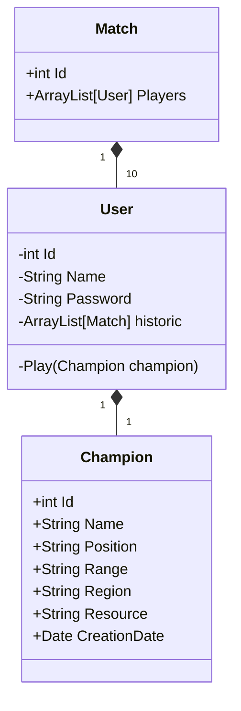

```mermaid
classDiagram
    
    Match "1" *--"10" User
    User "1" *--"1" Champion


    class Match{
        +int Id
        +ArrayList[User] Players
    
    }

    class Champion{
        +int Id
        +String Name
        +String Position
        +String Range
        +String Region
        +String Resource
        +Date CreationDate 
    }

    class User{
      -int Id
      -String Name
      -String Password
      -ArrayList[Match] historic
      -Play(Champion champion)
    }
```